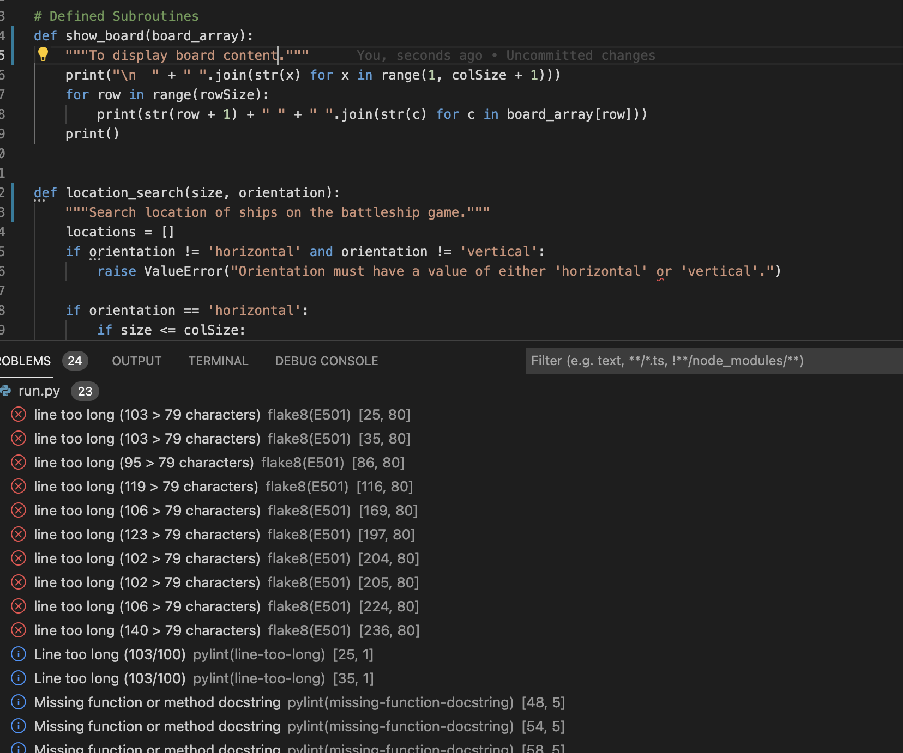

# Battleship Game using OOP and Functions

## What is Battleship?

* The purpose of the game is a one player simulation game that runs via the Heroku web platform.  

* The following link offers some detail on the game functionality: [Battle ship Game](https://en.wikipedia.org/wiki/Battleship_(game)).

* The electronic terminal game will focus on the user selecting a location of a random ship placement on a 2D board.  They will be asked for a row and column coordinate to identify if there is a ship in this location.  

## How to play the intended Battleship game

* Utilsing a menu system for the user to be able to select options from the following:
  * Configure the battleship board
  * Play the game
  * View latest scores based on the grid size and number of ships - whether utilising a module extension similar to that on the Love Sandwiches walkthrough, utilising Google Sheets to update the latest scores
  * Exit the game function at the end of the game
* The user will be asked specific board configurations, linked to board size for the number of rows and columns, number of ships and their represented sizes, along with the number of goes within the game
* The user will be presented with a board that masks the ship locations with a ``~`` symbol 
* The user selects the coordinates on a 2D array, identified as a row and column to locate the ship
* If a ship is found then the symbol changes to a ``X`` otherwise replaced with a ``*`` to represent missing the ship.
* If the user sinks all ships within the allocated moves, then the game will stop
* Otherwise if the user does not sink all the ships within the permitted time frame, the game is lost and appropriate messages in both situations displayed on the screen to the user.
* 

# Features

## Existing Features

## Future Features
* Develop a GUI utilising features from ``Pygame`` that allows the user to select the grid item, not enter via a terminal
* Extend the game feature to allow more than two players on the battleship, rather than Player vs. Computer
* Fix recommended adjustments from the PEP8 online checker to ensure all warning and errors are solved prior to second release
  
## Testing

* I have passed the python terminal code through PEP8 to identify errors, which are noted below and time will be required for fix each error.  The biggest issues were the length of some of the lines of code, which need to be split up and it does not like the lack of doc strings and camelCase naming convention.  It prefers snake_case conventions, so will need to adjust.  
* Checked relevant inputs associated to each function and will further check validation requirements against associated functions, such as returning suitable choices from pending menu system.
* Tested via local application, visual studio code and via GitPod.  Will also check with Heroku in final iteration. 
### 24/11/2021

After creating the first version of the game, 51 problems were noted that require fixing, ranging from lines of code being too long and not using docstrings (as well as not satisfying the convention of using different parameter names from an arugment when a subroutine is called).  The aim of this iteration is to ensure that the 1 player mode works as intended before adding the Computer element to the game.  

This is a noted constraint informed by Code Institute => ``The deployment terminal is set to 80 columns by 24 rows. That means that each line of text needs to be 80 characters or less otherwise it will be wrapped onto a second line.``

Adjustments thus far, focuses on correcting the name casing (to snake_case) and adding inline docstrings.  The results so far has reduced the number of problems to 24.  Further additions will be worked on before adding the computer element to the two player game.  Including adding further docstrings and reducing the lines of code on the problematic lines.   

## Deployment onto the Heroku app

When you create the app, you will need to add two buildpacks from the _Settings_ tab. The ordering is as follows:

1. `heroku/python`
2. `heroku/nodejs`

You must then create a _Config Var_ called `PORT`. Set this to `8000`

If you have credentials, such as in the Love Sandwiches project, you must create another _Config Var_ called `CREDS` and paste the JSON into the value field.

Connect your GitHub repository and deploy as normal.

## Credits and References
* Code institute for google sheet walkthrough and link to scoring system
* Relevant code platforms to inform OOP usage, such as:
  * [Isaac Computing](https://isaaccomputerscience.org/topics/object_oriented_programming?examBoard=all&stage=all)